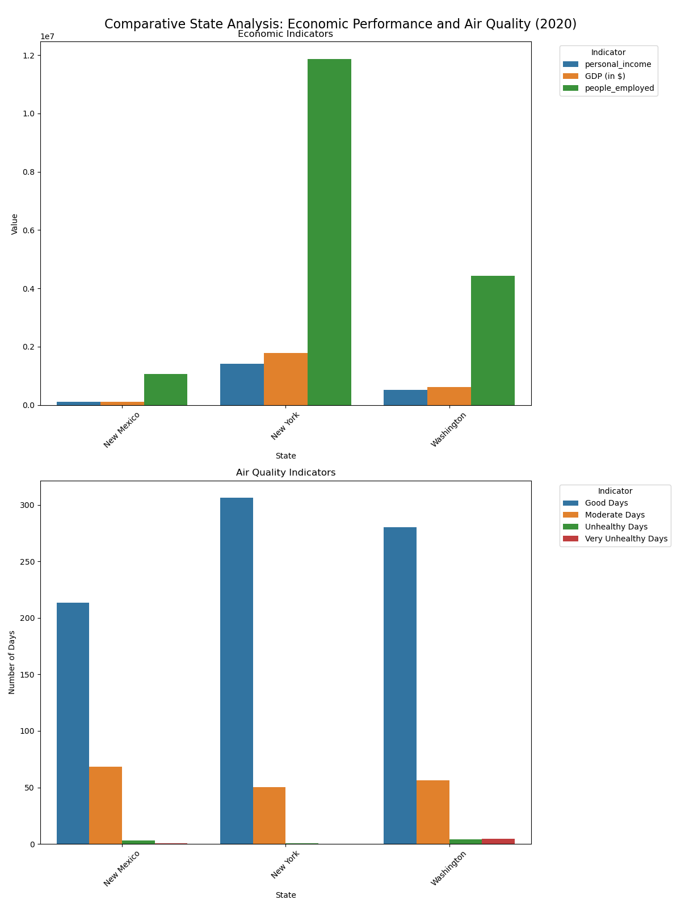
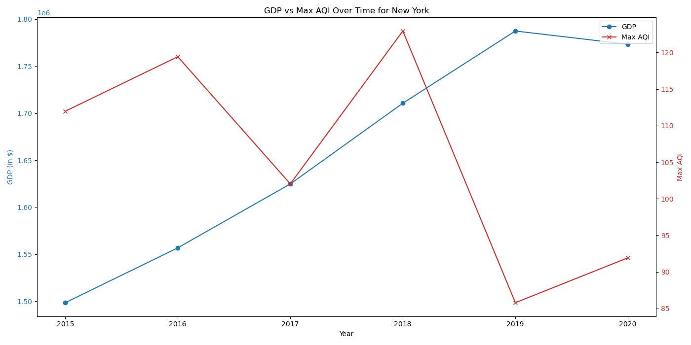
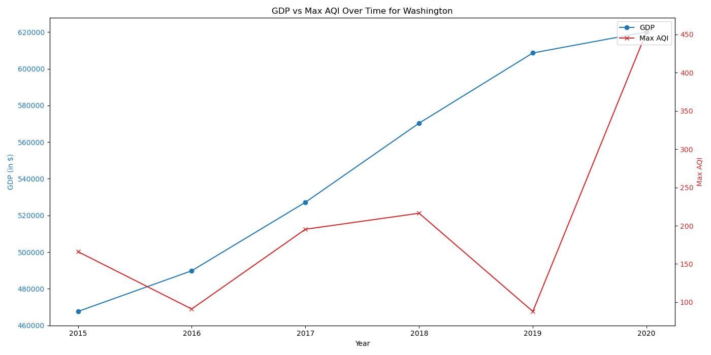

# python_project_1

## Table of Contents
* [Research Question](#research-question)
* [Analyses](#analyses)
* [Usage](#usage)
* [Installation](#installation)
* [Dependencies](#dependencies)
* [Citations](#citations)

## Research Question
"How do economic growth and air quality metrics interact, and what implications do these interactions have for public health strategies?"
* Params
- Locations: NY, WA, NM
- Timeframe: 2015 - 2020

## Analyses

### Analysis #1
Comparative State Analysis: Recent Economic Performance vs. Air Quality
- This establishes a baseline understanding of how the latest economic indicators relate to air quality metrics in our chosen states. providing a snapshot of whether states with stronger economies maintain better or worse air quality. 

Conclusion:
- These findings imply that effective environmental policies,geographical factors, and the nature of economic activitiesplay crucial roles in determining air quality alongside economic performance. Further research into specific industries, population density, and environmental regulations would provide more comprehensive insights into these relationships.
- The analysis challenges the common assumption that higher economic activity leads to poorer air quality, as demonstrated by New York's superior performance in both economic metrics and good air quality days (306 days) compared to the smaller economies of Washington (280 days) and New Mexico (213 days).

### Analysis #2
Time Series Analysis: GDP vs. AQI for New York State & Washington
- This analysis examines the relationship between economic growth (measured by GDP) and air quality (measured by Max AQI) in New York State and Washington from 2015 to 2020. 
- It aims to reveal potential correlations or divergences between economic performance and environmental quality over time in both states given that Washington had the most 'Very Unhealthy Days'.

Conclusion:
- From 2015 to 2020, New York's GDP grew from approximately $1.5 trillion to $1.77 trillion, reflecting consistent economic expansion despite a slight dip in 2020 due to the pandemic, while Washington's GDP increased steadily from $467 billion in 2015 to $620 billion in 2020, showcasing robust economic growth.
- Unlike New York, Washington's GDP and Max AQI trends diverged more noticeably, indicating that economic growth may have coincided with periods of poorer air quality. The differingtrends between New York and Washington highlight the importance of tailored environmental policies and management strategies to balance economic growth with air quality maintenance.
- These findings underscore the critical need for integrated public health strategies that address the environmental impacts of economic activities, ensuring that economic prosperity does not come at the cost of public health.

### Analysis #3
blank
- 

Conclusion:
-

## Usage
1. 
2. 
3. 
4. 

## Installation
1. 
2. 
3. 
4. 

## Dependencies

## Citations
U.S. Bureau of Economic Analysis. (2024). Regional GDP & Personal Income, 2015-2020[Data set]. U.S. Department of Commerce. Available from [BEA.gov/iTable](BEA.gov/iTable)

U.S. Environmental Protection Agency. (2024). Air Quality Index (AQI) by County, 2015-2020 [Data set]. Air Quality System Data Mart. Available from [https://aqs.epa.gov/aqsweb/airdata/download_files.html](https://aqs.epa.gov/aqsweb/airdata/download_files.html)
